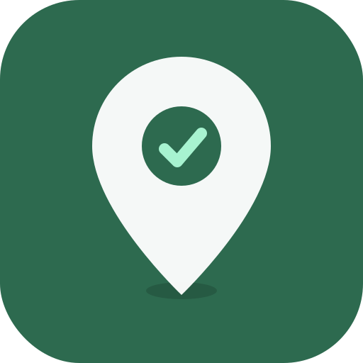

# Tag Control — Quiénes Somos

---

## La historia

Tag Control nació de una conversación simple entre un hijo y su papá.

Raúl vive en Algarrobo y viaja seguido a Santiago. Nunca quiso contratar TAG — le parecía caro y poco transparente. Pero tampoco tenía forma de saber cuánto gastaba en peajes cada mes.

Un viernes de abril de 2026, decidimos resolver el problema. Ese mismo día, Raúl hizo su primer viaje con Tag Control. La app detectó el Peaje Troncal Zapata a las 15:38 hrs. Primer peaje registrado en la historia de Tag Control.

Desde ahí, no paramos.

---

## Qué es Tag Control

Una Progressive Web App (PWA) que usa el GPS del celular para detectar automáticamente cada peaje que cruzas en las autopistas de Chile.

Nuestro isotipo es un pin de mapa con un check adentro: cada peaje marcado en tu ruta, cada peso verificado en tu cuenta. Claridad sobre tus gastos, punto por punto.

No necesitas TAG. No necesitas descargar nada del App Store. Abres un link, creas tu cuenta con nombre y PIN, y empiezas a registrar.

---

## Cómo funciona

1. Abres la app y presionas "Comenzar viaje"
2. El GPS detecta cada peaje que cruzas y suena una alerta
3. Al llegar, presionas "Detener viaje" y ves el resumen
4. Tu historial se guarda en la nube — nunca pierdes un dato

---

## Qué cubrimos

- **Ruta 68** — Peaje Zapata, Lo Prado
- **Costanera Norte** — 11 pórticos del eje + Kennedy
- **Autopista Central** — 5 pórticos
- **Vespucio Norte Express** — 5 pórticos
- **Vespucio Sur** — 4 pórticos
- **Ruta 78 (Autopista del Sol)** — 3 peajes
- **Autopista Nororiente** — Peaje Chicureo
- **Túnel San Cristóbal**
- **Vespucio Oriente (AVO)**

35+ peajes en 8 autopistas de Santiago y rutas interurbanas.

---

## El equipo

Tag Control es un proyecto familiar construido con tecnología moderna:

- **React + Vite** para una app rápida y liviana
- **Supabase** para datos en la nube en tiempo real
- **Google Maps API** para planificación de rutas
- **GPS nativo** de Safari iOS para detección de peajes

---

## Contacto

tagcontrol.vercel.app

Construido en Chile, para Chile.

Abril 2026.
